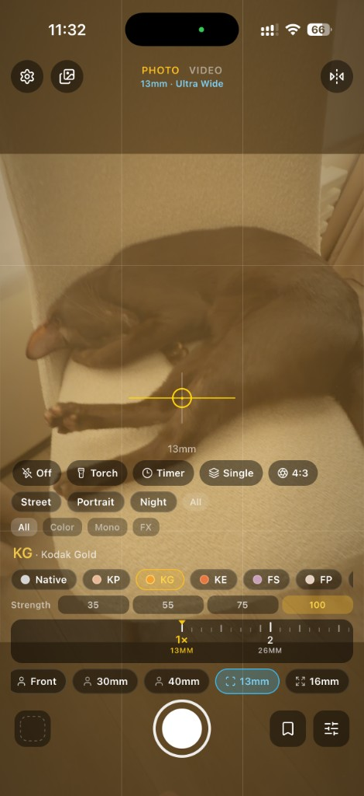
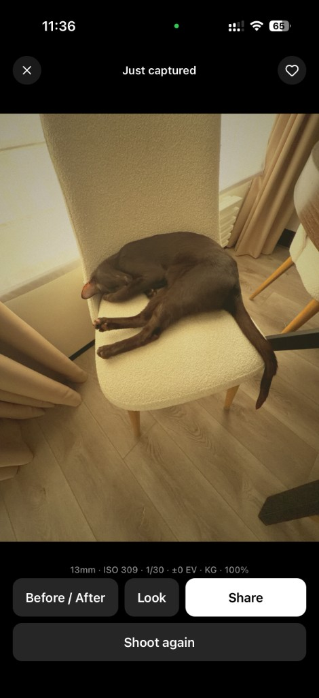

<div align="center">
  
  <h1>Iris</h1>
  <p>
    <strong>Expo SDK 57</strong> · <strong>Vision Camera v5</strong> · <strong>iOS</strong> · <strong>MIT</strong>
  </p>
</div>

<br />

<table>
<tr>
<td width="50%" valign="top" align="center">

</td>
<td width="50%" valign="top" align="center">

</td>
</tr>
</table>

<p>Iris is a pro camera app for iOS. It features:</p>
<ul>
<li>📱 Multi-lens switching (<code>0.5×</code> / <code>1×</code> / tele) and smooth zoom</li>
<li>📸 Photo &amp; video capture → dedicated <strong>Iris</strong> album in Photos</li>
<li>🎛️ Manual Pro controls (ISO, shutter, WB, focus, EV)</li>
<li>🎨 Look presets with native bake into captures (<a href="modules/iris-look-bake/"><code>iris-look-bake</code></a>)</li>
<li>🧭 Assist overlays: grid, level, histogram, zebra, peaking, aspect crop</li>
<li>⚡ Capture presets, scene chips, countdown, volume shutter</li>
<li>🖼️ Gallery + last-shot review</li>
</ul>

<br />

> Iris is a pro camera app for iOS built with Expo Dev Client, Vision Camera, and a custom native look-bake module.
>
> Android packaging is scaffolded; the primary target today is iOS on a physical device.

## Quick start

```bash
nvm use && npm install
npm run prebuild:ios && cd ios && pod install && cd ..
npm run ios
```

A **physical iPhone** is required for camera preview and capture (Simulator has no camera hardware).

Day to day after the first native build:

```bash
npm start              # expo start --dev-client
# open the Iris Dev Client on device
```

### Links

- [Repository](https://github.com/dmitryshelomanov/iris)
- [Issues](https://github.com/dmitryshelomanov/iris/issues)
- [Expo SDK 57 docs](https://docs.expo.dev/versions/v57.0.0/)
- [Vision Camera](https://github.com/mrousavy/react-native-vision-camera) · [docs](https://visioncamera.margelo.com)
- [Expo Router](https://docs.expo.dev/router/introduction/)
- Native look bake: [`modules/iris-look-bake/`](modules/iris-look-bake/)

## Requirements

- Node **22.13+** (see [`.nvmrc`](.nvmrc))
- Xcode + CocoaPods (`pod` on `PATH`)
- Physical iPhone for camera preview and capture

## Scripts

| Script               | Purpose                                       |
| -------------------- | --------------------------------------------- |
| `npm start`          | Metro + Dev Client                            |
| `npm run ios`        | Native Debug build and launch                 |
| `npm run ios:prod`   | Release build on a physical device (no Metro) |
| `npm run lint:types` | Typecheck (`tsc --noEmit`)                    |
| `npm run format`     | Prettier write                                |

## Stack

| Layer   | Choice                                       |
| ------- | -------------------------------------------- |
| App     | Expo SDK 57 + Dev Client (not Expo Go)       |
| Routing | Expo Router (`app/`)                         |
| UI      | NativeWind + Reusables in `src/shared/ui/`   |
| Camera  | `react-native-vision-camera` + Nitro modules |
| Looks   | Local Expo module `modules/iris-look-bake`   |
| Icons   | `lucide-react-native`                        |

## Project structure

Feature-Sliced Design under `src/`, with thin Expo Router screens in `app/`:

```
app/                          Expo Router entry points
  (tabs)/index.tsx            Camera
  gallery.tsx                 Gallery
  settings.tsx                Capture defaults
  permissions.tsx             Permission help

src/
  pages/                      Screen compositions
  widgets/camera-screen/      Main camera widget
  features/camera/            Lenses, manual, looks, overlays
  features/media/             Recents, review UI
  features/onboarding/        Permission / onboarding gate
  entities/capture/           Library save + recents model
  shared/                     Theme, utils, UI primitives

modules/iris-look-bake/       Native look bake (photo / video)
assets/images/                App icon, splash, Android adaptive icons
docs/images/                  README screenshots
```

## Simulator vs device

|                 | Simulator | Physical iPhone        |
| --------------- | --------- | ---------------------- |
| UI / navigation | Yes       | Yes                    |
| Camera preview  | No        | Yes                    |
| Lens switching  | N/A       | Yes (device-dependent) |
| Capture / bake  | No        | Yes                    |

## Icons and splash

Source assets live in [`assets/images/`](assets/images/) and are wired in [`app.json`](app.json). Native iOS copies live under `ios/Iris/Images.xcassets/`.

After changing icons or splash, rebuild the native app (`npm run ios`). If the home-screen icon does not update, delete the app from the device and reinstall.

### About

Built by **[Dmitry Shelomanov](https://dmitryshelomanov.github.io/)** — Senior Frontend / React Native developer.

### Socials

- 🌐 [**Personal site**](https://dmitryshelomanov.github.io/)
- 💬 [**Telegram**](https://t.me/dmitryshelomanov)
- 🐙 [**GitHub**](https://github.com/dmitryshelomanov)

## License

[MIT](LICENSE) © Dmitry Shelomanov
